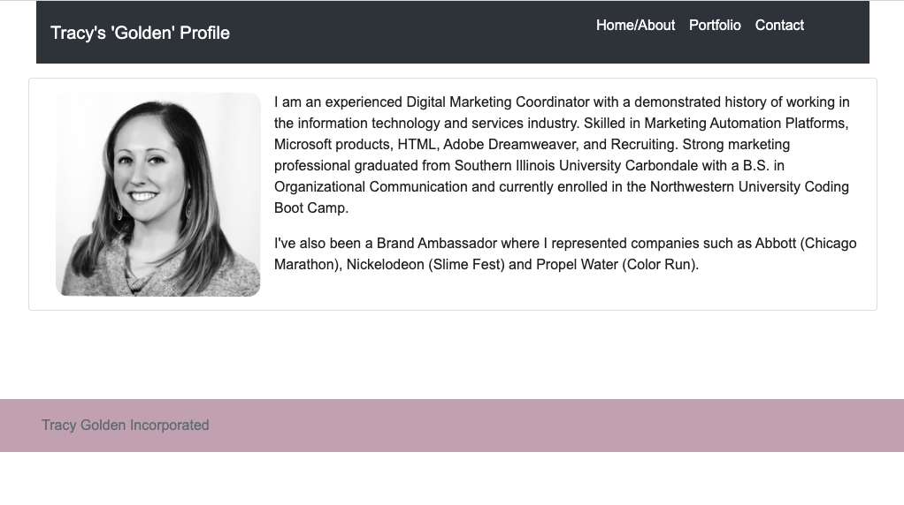

# tracy80s2003.github.io

# responsive-portfolio
02-homework

## Overview
Using the Bootstrap CSS Framework, I created a responsive portfolio. 

I created 3 files: `index.html`, `portfolio.html` and `contact.html`. Then, I developed my portfolio by adding a navbar, images and a responsive layout. Throughout the building and modification process, I switched my 
 tags to be semantic, used a grid system, and validated my html to ensure each page was valid.

The nav bar is consistent on all 3 pages and there are working links to each page as well. The index (Home/About) page consists of a nav bar, profile image, and a short bio. The portfolio page consists of images, text and links from homework and/or projects. This page will continue to grow. The contact page includes a "click here" link so people can connect with me on LinkedIn and they can also fill out a form if they would like to send me an email.

## Instructions
1. Updated Portfolio (https://tracy80s2003.github.io/)
2. GitHub Profile (https://github.com/tracy80s2003)
3. Updated Resume
4. Updated LinkedIn (https://www.linkedin.com/in/tracy-golden/)

## Features
Hover over text links for a different color.

## Portfolio Screenshot:

## Portfolio Repository
https://github.com/tracy80s2003/tracy80s2003.github.io